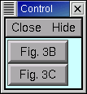
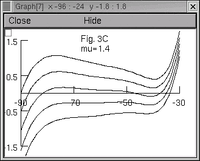
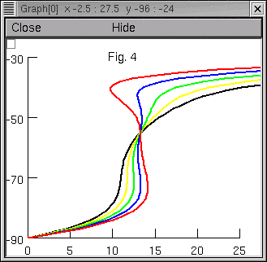
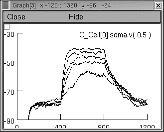
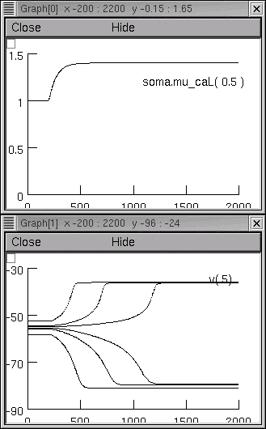
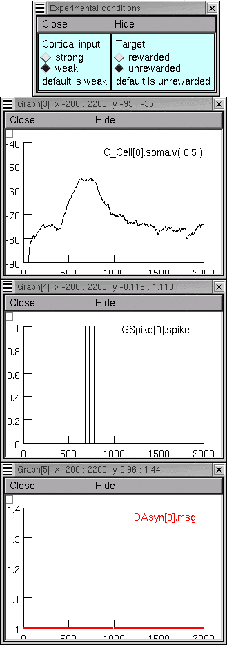
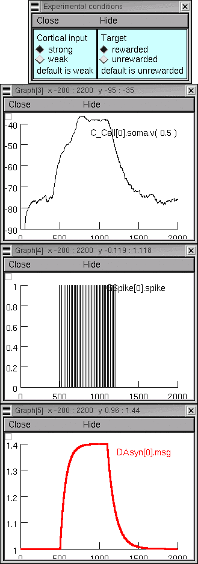
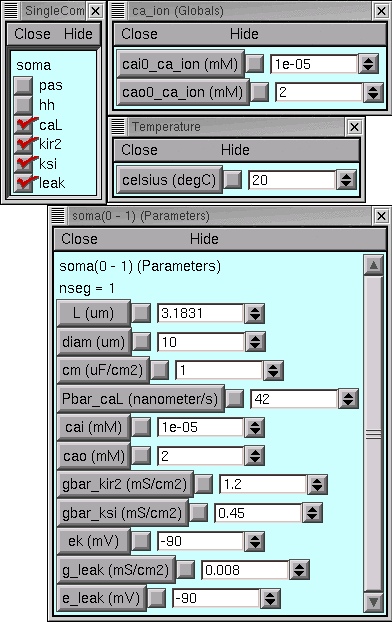

# NEURON implementation of spiny neuron model

These programs reproduce figures from the paper
"Modulation of Striatal Single Units by Expected Reward:
A Spiny Neuron Model Displaying Dopamine-Induced Bistability"
Aaron J. Gruber, Sara A. Solla, D., James Surmeier, and James C. Houk
*J Neurophysiol* 90: 1095 1114, 2003

Address questions to Ted Carnevale
[ted.carnevale@yale.edu](mailto:ted.carnevale@yale.edu)

The following comments show [how to operate](#usage) these programs,
and discuss the [implementation of the models](#implementation)
and how to reuse this code.

## Usage

1. Unzip spinycell.zip into an empty directory.
2. Compile the mod files with nrnivmodl (or mknrndll if you're using MSWin)
3. Follow the instructions below.


### Figs. 2 and 3A

Use NEURON to execute [figs2and3A.hoc](figs2and3A.hoc)
Click on the Plot button in each of the three Graphers.

> 


### Figs. 3B and C

Use NEURON to execute [fig3BC.hoc](fig3BC.hoc)
Click one of the buttons in this small panel
> 

to bring up a plot that reproduces Fig. 3B
> 

or Fig. 3C
> 


### Fig. 4

Use NEURON to execute [fig4.hoc](fig4.hoc)
The graph is created automatically.
> 


### Fig. 6

Use NEURON to execute [fig6.hoc](fig6.hoc)
On the right there is a graph window.
Just below this is a small panel with buttons labeled "Fig. 6a" and "Fig. 6b".
Click on one of these to generate the corresponding family of plots.

> **Fig. 6a**
> 

> **Fig. 6b**
> 

Notes:
1. The first 200-300 ms of each trace is a "warmup" or "stabilization" interval
during which the model reaches a dynamic equilibrium appropriate for the baseline synaptic drive.
2. The increase of synaptic drive starts at 400 ms.
3. The pseudorandom afferent spike trains are different on each run,
so each press of these buttons produces a slightly different family of traces.
However, the envelopes of the individual trajectories are essentially similar from run to run.

**Example: repeat "Fig. 6b run"**
> 

4. Mean synaptic conductance appears to be
the primary determinant of the membrane potential trajectories.
Other details of synaptic input (negexp ISI spike trains driving
the relatively simple ExpSyn mechanism here,
vs. the more complex, empirically derived model of synaptic activity
used by Gruber et al.) affect only the low-level fluctuations of the individual traces.


### Figs. 7A and B

Use NEURON to execute [fig7a.hoc](fig7a.hoc)
or
[fig7b.hoc](fig7a.hoc)
The graphs are created automatically.

> **Fig. 7A**
> 

> **Fig. 7B**
> 

Note: The actual values of mu used for the figures in the paper were not available.
The values used in these programs are sufficient
to demonstrate the same dynamical features of the
model that were illustrated by the original figures.


### Fig. 10A and B

Use NEURON to execute [fig10ab.hoc](fig10ab.hoc)
This brings up several windows, the rightmost of which are a stack of graphs.
From the top down, these graphs will show

- the membrane potential of the spiny neuron
- the cortical input spike train
- the time course of the modulatory action of dopaminergic input

Above these graphs is a small panel with four radio buttons that set the "experimental conditions."
Select one of the four possible combinations and click
on the RunControl's Init & Run button to launch a simulation.

> **Example 1: weak cortical input, target unrewarded**
> 

> **Example 2: strong cortical input, target rewarded**
> 

Notes:
1. During the first few hundred ms, the model reaches a
dynamic equilibrium appropriate for the background synaptic drive.
2. Sequential runs under the same conditions will differ because
a different afferent spike train is used each time.


## Model implementation

Among these files there are actually two different implementations of a
spiny neuron model.
The first is used to generate the figures that illustrate
the basic properties of the model (Figs. 2 - 4 and 7),
and the second is used for those figures that show
how dopamine affects the model's response to afferent spike trains
(Figs. 6 and 10).

Both implementations use the same membrane currents,
which are specified by these files:

```
caL.mod
kir2.mod
ksi.mod
leak.mod
```

Of these, only caL.mod includes temperature dependence
(needs `celsius = 20` to reproduce the figures from the paper).

Some of the programs also use the mechanisms specified in
one or both of these files:

```
damsg.mod
gspike.mod
```

These mechanisms are described later in this document.


### Implementation 1: a "stand-alone" model cell

The properties of the model used for Figs. 2 - 4 and 7 are specified by
these graphical tools
> 

These were set up with NEURON's GUI,
and they are recreated by having NEURON execute the code in **model_mu_1.ses**.
Think of this file as a "virtual experimental preparation,"
somewhat analogous to a single cell in tissue culture
or an acutely isolated soma.

This file is loaded by the following programs :

```
figs2and3A.hoc
fig3BC.hoc
fig4.hoc
fig7a.hoc
fig7b.hoc
```

It needs only one thing to be a complete specification of a model of a spiny neuron :
some way for the caL and kir2 mechanisms to discover the value of the "dopamine message."
In figs2and3A.hoc this is done by the statements

```
msg = 1

soma for (x,0) { // skip the nodes at 0 and 1
        setpointer mu_caL(x), msg
        setpointer mu_kir2(x), msg
}
```

which link the "mu" POINTERs of caL and kir2 to the hoc scalar msg.
Except for fig7a.hoc and fig7b.hoc,
the other programs that use model_mu_1.ses contain similar statements.
This is OK for simulations in which mu remains constant
or changes abruptly from one steady level to another.

For fig7a.hoc and fig7b.hoc, computational efficiency requires a different approach.
Unlike other simulations involving the "stand-alone model,"
these need msg to have nontrivial dynamics.
Using a hoc scalar and modifying NEURON's main computational loop
to force incremental changes in msg at every fadvance()
is not the best way to do this.

Therefore fig7a.hoc and fig7b.hoc employ a DAsyn point process.
This "net-ready" synaptic mechanism
has a state variable msg which, in this implementation,
has first order dynamics and can be driven by spike events.
The file fig7syn.hoc contains the statements that link
the "mu" POINTERs of caL and kir2 to this msg.

> DAsyn is also used in the program that reproduces Fig. 10 (see below).


### Implementation 2: a "networked" model cell

The "networked" model cell is used by these two programs:

```
fig6.hoc
fig10ab.hoc
```

This model implementation has
a "fast conductance change excitatory synapse" (ExpSyn)
that receives spike trains representing afferent cortical activity.
It happens to be implemented with NEURON's NetReadyCellGUI tool,
but its anatomical and biophysical properties are identical to
those of the "stand-alone" model.

The NetReadyCellGUI tool that specifies the properties of this "biological model cell",
and the ArtCellGUI tool that specifies the properties of the
artificial spiking cells that generate the afferent spike trains,
were created using NEURON's GUI and saved to session files called
fig6netcells.ses
and
fig10netcells.ses.

> As noted above, the conductance fluctuations
used in the simulations reported by Gruber et al.
are quite different from those generated by
spike trains with negexp statistics converging on an ExpSyn mechanism.
Even so, the simulation results produced by these files
are qualitatively quite similar to the published figures.
Mean synaptic conductance, rather than its detailed fluctuations,
appears to be the principal factor
that governs the time course of membrane potential.

Network architectures were specified with the NetGUI tool and saved to
session files called
fig6net.ses
and
fig10net.ses.
"Instrumentation" (simulation controls and graphical displays of results) are contained in
fig6netrig.ses
and
fig10netrig.ses.

fig6.hoc uses a simple hoc scalar called msg to represent dopaminergic effect,
and the mu POINTERs of the caL and kir2 mechanisms are linked
to it in the file fig6.hoc.
As noted previously, the simulations that generate Figure 10
use a DAsyn point process so that msg can have its own dynamics
and yet be computationally efficient.
fig10syn.hoc contains the statements that link the mu POINTERs of caL and kir2
to the DAsyn's msg.

> The "spike" mechanism used by Gruber et al. 2003 for Fig. 10
requires an implementation that demands fig10ab.hoc be run only with
fixed time step integration (see gspike.mod).

**Reusable hoc code**

c_cell.hoc contains a template (class definition) for model neurons with
properties identical to the one that was used
to generate Fig. 10, complete with both an ExpSyn (to receive "cortical
input spikes") and a DAsyn (to receive "dopaminergic input spikes").
It can be used, with or without NEURON's GUI,
to spawn new instances of this model neuron
that are suitable for use in network simulations.

> ```
> load_file("c_cell.hoc")
> objref foo
> foo = new List()
> for i=0,99 foo.append(new C_Cell())
> foo.count()  // returns 100
> // now there are 100 of these cells ready to be connected into a network
> ```

**Caveat:**
Be sure to specify the operating temperature, e.g.

```
celsius = 20
```

> **How I created c_cell.hoc**
>
> 1. Clicked on the "Hoc File" button of fig10ab.hoc's NetGUI tool
> and specified fig10network.hoc as the name of the output file
> 2. Extracted the template for the C_Cell class from fig10network.hoc
> 3. Finally, made one small but important modification to the C_Cell template:
> adding a "forsec all" loop to proc synapses() so that the
> mu POINTERs of every instance of caL and kir2 will be
> linked to the DAsyn's msg variable
>
> Here's the modified proc synapses()--
> ```
> proc synapses() {
>   /* ExpSyn0 */   soma syn_ = new ExpSyn(0.5)  synlist.append(syn_)
>     syn_.tau = 3
>   /* DAsyn1 */   soma syn_ = new DAsyn(0.5)  synlist.append(syn_)
>   // attach all POINTERs to DAsyn.msg
>   forsec all {
>     if (issection("caL")) {
>       for (x,0) { // skip the nodes at 0 and 1
>   setpointer mu_caL(x), synlist.object(1).msg
>       }
>     }
>     if (issection("kir2")) {
>       for (x,0) { // skip the nodes at 0 and 1
>   setpointer mu_kir2(x), synlist.object(1).msg
>       }
>     }
>   }
> }
> ```

---

2025-05-27 – Standardized to Markdown